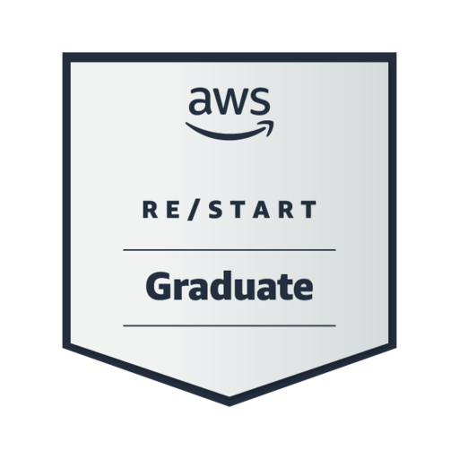

<h1>Hi 👋, I'm Indrajit Dan</h1>
<h3>🚀 AWS Certified Solutions Architect | DevOps Engineer</h3>

  

  

  

---

### 🧑‍💻 About Me

AWS Certified Solutions Architect Associate and AWS
Certified Cloud Practitioner with hands-on expertise in cloud platforms, DevOps automation, and Infrastructure as Code. Skilled in designing, deployed, and managed secure, scalable environments using Terraform, Ansible, Docker, and Kubernetes.

**Right now I’m focused on:**

- Gaining hands-on experience with AWS core services (EC2, S3, Lambda, VPC, IAM, RDS, EKS)
- Building and managing containerised applications using Docker
- Writing Bash scripts to automate real-world DevOps and cloud workflows
- Learning and implementing CI/CD pipelines for deployment and infrastructure automation

## 🔧 Tech stack

<!-- Core -->

<!-- Containers & caching -->

<!-- Cloud (AWS core services) -->

---

### 🚀 Project Highlights

#### 📦 AWS EKS Microservices – Video to MP3 Converter
- Reduced infrastructure setup time by 70% using Helm & Terraform
- Handled 100+ concurrent tasks with RabbitMQ + replica pods
- EBS CSI Driver + PVCs for dynamic storage provisioning
- Zero-downtime deployments with rolling updates (maxSurge: 8)
- Secured environment using Kubernetes Secrets

#### 🏗️ AWS Multi-Tier Architecture
- Designed production-grade system with **ELB**, **Auto Scaling Groups**, and **RDS**
- Saved 15% monthly cloud spend using **Reserved Instances** and **S3 Lifecycle Policies**
- Enforced AWS security best practices across compute, IAM, and storage layers

---

### 🛠️ Skills & Tools

  
  
  
  
  
  
  
  
  
  

---

### 🌐 Portfolio

📄 Visit my live portfolio (virtual resume):  
🔗 [**Danify**](https://danify-v0vn.onrender.com/)

---

### 📊 GitHub Stats

  

---

### 📬 Contact Me

  
  
  
  
   
  

---

### 🧾 Certifications

- ✅ AWS Certified Solutions Architect Associate  
- ✅ AWS Certified Cloud Practitioner  

---

### ⚡ Fun Fact

> I automate everything — even my coffee machine has a CI/CD pipeline ☕🚀
